# PROPERTY MANAGEMENT CRUD SYSTEM

This project is a CRUD (Create, Read, Update, Delete) system for managing real estate properties. The goal is to build a simple web application that allows users to perform the following operations on property listings:

- Create new property listings.
- Read and view the complete list of properties and their details.
- Update the information of an existing property.
- Delete property listings.

## 🖥️ Server Features

The code is structured into different classes and packages to maintain clean, organized, and scalable architecture. This structure also simplifies future code extensions.

Some of the server's key features include:

- Create and manage properties.
- Search functionality with filters (price, size, address).
- Cloud deployment on AWS.
- User-friendly web interface.

## 📁 Project Structure

```
│──  src
│   ├──  main
│   │   ├──  java
│   │   │   └──  com.eci.AREP_TALLER05_MANUELS
│   │   │       ├──  controller
│   │   │       │   ├── PropertyController.java
│   │   │       ├──  model
│   │   │       │   ├── Property.java
│   │   │       ├── repository
│   │   │       │   ├── PropertyRepository.java
│   │   │       ├── service
│   │   │       │   ├── ApplicationProperty.java
│   │   │       ├── AREP_TALLER05_MANUELSApplication.java
│   │   ├──  resources
│   │   │   ├──  static
│   │   │   │   ├── index.html
│   │   │   │   ├── script.js
│   │   │   │   ├── styles.css
│   │   │   ├──  application.properties
│   ├──  test
│   │   ├── java
│   │   │   ├── PropertyTest.java
│   ├──  target
│   ├──  .gitignore
│   ├──  Dockerfile
│   ├──  LICENSE
│   ├──  README.md
│   ├──  docker-compose.yml
│   ├──  pom.xml
```

## 🛠 Class Design

📄 **Model:** `Property`
- Represents the property in the database.
- Mapped as an entity using JPA/Hibernate.

📄 **Repository:** `PropertyRepository`
- Interface for accessing data with JPA/Hibernate.
- Extends `JpaRepository` to provide CRUD operations.

📄 **Service:** `ApplicationProperty` (💡 We should rename this to `PropertyService` for consistency)
- Contains the business logic.
- Acts as a bridge between the controller and the repository.

📄 **Controller:** `PropertyController`
- Exposes RESTful endpoints to interact with property data.
- Handles HTTP requests (GET, POST, PUT, DELETE).

##
## 🏛 System Architecture

1. 🧑‍💻 Architecture: MVC (Model-View-Controller)
2. 🚀 Framework: Spring Boot
3. 🗃️ Database: MySQL
4. 🐋 Containerization: Docker
5. ☁️ Cloud Deployment: AWS
6. 🔄 CI/CD: GitHub Actions
7. 📝 API Documentation: Swagger

## 🖥️ Repository Setup and Execution

### 📂 1. Clone the repository

```bash
git clone https://github.com/ManuelSuarez07/AREP-MANUELS-TALLER05.git
```

### 💻 2. Navigate into the project directory

```bash
cd AREP-MANUELS-TALLER05
```

### 🧹 3. Clean and install dependencies

```bash
mvn clean install
```

### 📦 4. Package the application

```bash
mvn clean package
```

### 🚀 5. Run the application

```bash
mvn spring-boot:run
```

---
# 🚀 Application Deployment on AWS with Docker

This document describes the steps needed to deploy the application using Docker and AWS.

## 📝 Prerequisites

- 🌐 AWS account
- 🖥️ Configured EC2 instances
- 🐋 Docker and Docker Compose installed
- 🗂️ Docker images uploaded to Docker Hub (`manuelsuarez07/backend-property-app` and `manuelsuarez07/mysql-property-db`)

---

## 🖱️ 1. Connect to the EC2 Instance

```bash
# SSH connection to the instance
ssh -i "your-key.pem" ec2-user@your-ip-address
```

---

## ⚙️ 2. Docker Configuration

### 🐧 2.1 Install Docker (if not already installed)

```bash
sudo yum update -y
sudo yum install docker -y
sudo service docker start
sudo usermod -aG docker ec2-user
```

### 🔍 2.2 Verify installation

```bash
docker --version
```

---

## 🔐 3. Login to Docker Hub

```bash
docker login -u "manuelsuarez07"
```

---

## 📥 4. Pull Docker Images

```bash
# Pull backend image
docker pull manuelsuarez07/backend-property-app

# Pull database image
docker pull manuelsuarez07/mysql-property-db
```

---

## 🏗️ 5. Deploy Containers

### 🌐 5.1 Create Docker network

```bash
docker network create property-network
```

### 🗃️ 5.2 Deploy Database

```bash
docker run -d --name mysql-db --network property-network -e MYSQL_ROOT_PASSWORD=your_password -e MYSQL_DATABASE=property-db manuelsuarez07/mysql-property-db
```

### 🖥️ 5.3 Deploy Backend

```bash
docker run -d --name backend-app --network property-network -e DB_HOST=mysql-db -e DB_USER=root -e DB_PASSWORD=your_password -p 8080:8080 manuelsuarez07/backend-property-app
```

---

## ✅ 6. Verify Deployment

### 🐋 6.1 Check running containers

```bash
docker ps
```

### 🌐 6.2 Test Backend API

```bash
curl http://your-ip-address:35000/test-endpoint
```

---

## 🎥 7. AWS Deployment Video

[🎥 Watch the deployment video]()

---

## 🛠️ 8. Troubleshooting

### 🛑 Database Connection Error

- 🕸️ Ensure that the containers are on the same Docker network.
- ⚙️ Check the environment variables for the database configuration.

### 🌐 AWS Access Issue from Your PC

- 🔒 Verify the security group rules of your EC2 instance.
- 💻 Try accessing from another machine to rule out local issues.

---

## 🐋 Docker Deployment Images

| 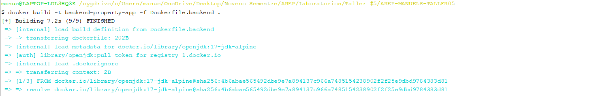 | 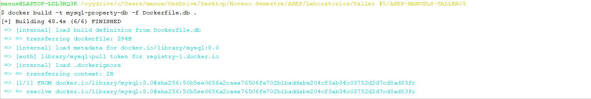 | 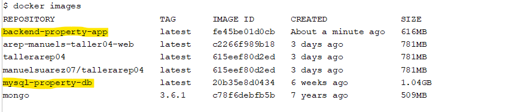 |
|----------------------------------|----------------------------------|----------------------------------|
| 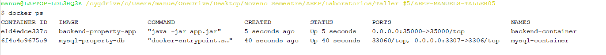 | 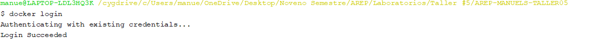 | 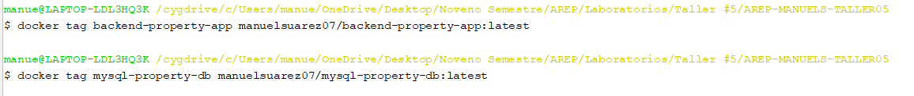 |
| 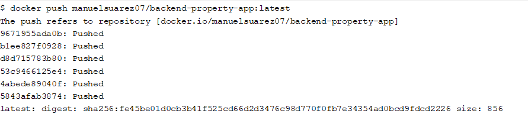 | 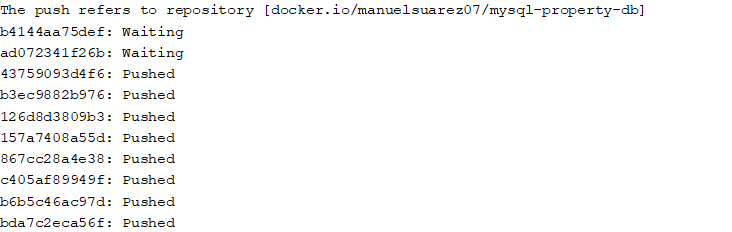 | 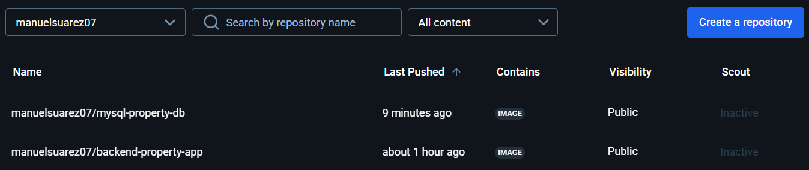 |

---

## 🌐 AWS Deployment Images

| 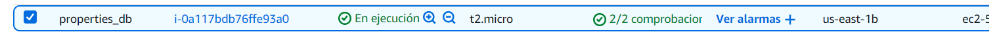 | 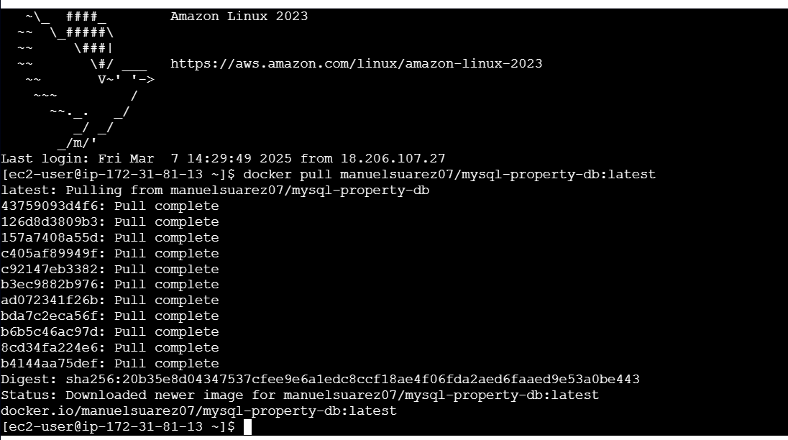 | 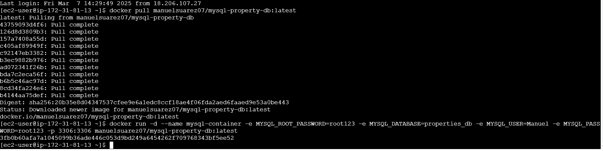 |
|-------------------------------|-------------------------------|-------------------------------|
| 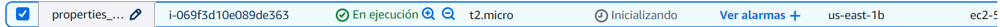 | 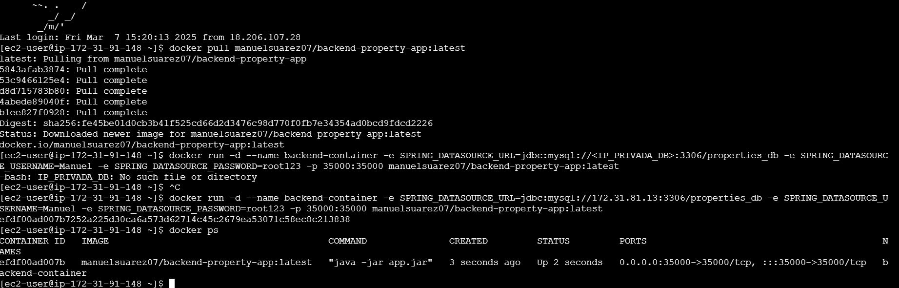 | 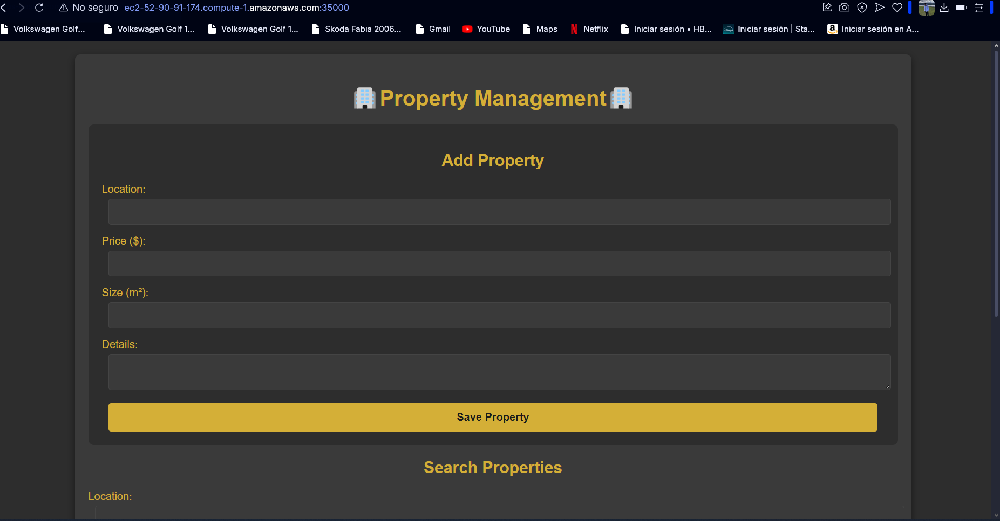 |

---

## 🎥 Deployment Videos

[🎥 Deployment Video](src/main/resources/Images/VideoFuncionamiento.mp4)
[🎥 AWS Deployment Video]
* https://www.youtube.com/watch?v=Pri7Ge3WBX0

---

🚀 **Deployment completed successfully!** 🎉


## 👤 Author

* **ManuelSuarez07**

## 🧰 Technologies Used

- Java, HTML, JavaScript, CSS
- Maven
- AWS
- Spring Boot
- MySQL
- Docker
- Swagger
- GitHub Actions
